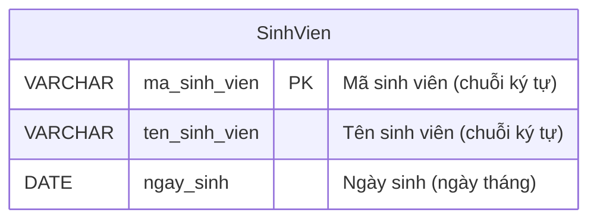

# BTVN 1: Quản lý sản phẩm (Thực thể Sinh viên)
*Lưu ý: Đề bài ghi tiêu đề là "Quản lý sản phẩm" nhưng nội dung yêu cầu là "Sinh viên", nên bài này sẽ tập trung giải quyết về Sinh viên.*

## 1. Mục tiêu
- Hiểu khái niệm thực thể (Entity)
- Biết cách biểu diễn thuộc tính trong ERD

## 2. Mô tả & Yêu cầu
Nhà trường cần lưu trữ thông tin cơ bản của sinh viên để quản lý.

## 3. Phân tích thực thể
- **Thực thể:** `SinhVien`
- **Các thuộc tính cơ bản:**
  - `ma_sinh_vien` (Khóa chính - PK): Để phân biệt không ai giống ai.
  - `ten_sinh_vien`: Họ và tên.
  - `ngay_sinh`: Ngày tháng năm sinh.

## 4. Sơ đồ ERD
*(Sử dụng kiểu dữ liệu chuyên môn kèm giải thích tiếng Việt dân dã)*

