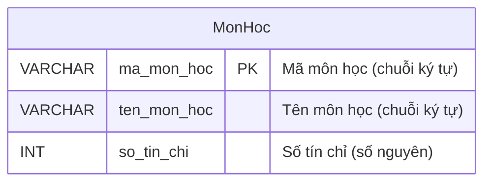

# BTVN 2: Quản lý môn học

## 1. Mục tiêu
- Rèn kỹ năng xác định thuộc tính cho thực thể
- Vẽ ERD đơn giản

## 2. Mô tả & Yêu cầu
Trường học cần lưu trữ thông tin các môn học được giảng dạy.

## 3. Phân tích thực thể
- **Thực thể:** `MonHoc`
- **Các thuộc tính cơ bản:**
  - `ma_mon_hoc` (Khóa chính - PK): Mã riêng của từng môn.
  - `ten_mon_hoc`: Tên môn (ví dụ: Toán, Lý).
  - `so_tin_chi`: Môn này nặng bao nhiêu tín chỉ.

## 4. Sơ đồ ERD

