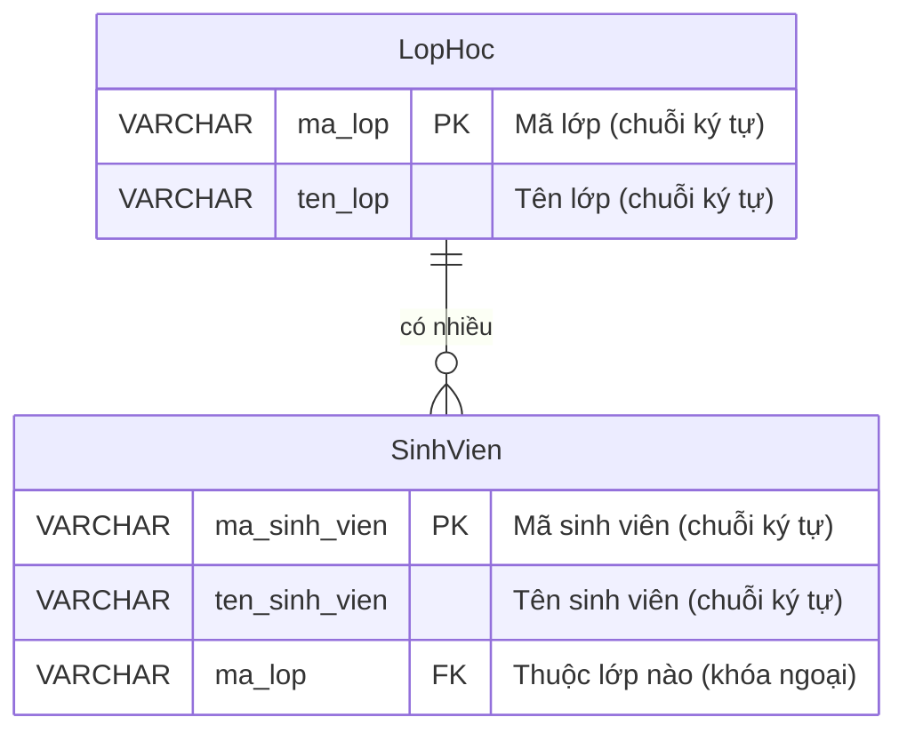

# BTVN 3: Quản lý sinh viên và lớp học

## 1. Mục tiêu
- Làm quen với khái niệm thực thể và mối quan hệ
- Vẽ sơ đồ ERD đơn giản (Thể hiện đúng kiểu quan hệ 1-N)

## 2. Mô tả & Yêu cầu
Trường học cần lưu trữ thông tin sinh viên và lớp học. Mỗi sinh viên chỉ học một lớp, một lớp có thể có nhiều sinh viên.

## 3. Phân tích thực thể & Quan hệ
- **Thực thể 1:** `LopHoc` (Gồm: mã lớp, tên lớp).
- **Thực thể 2:** `SinhVien` (Gồm: mã sinh viên, tên sinh viên).
- **Mối quan hệ:** Quan hệ **1 - N** (1 Lớp có Nhiều Sinh viên). Ta cần mượn "mã lớp" đưa vào thông tin của Sinh viên để biết sinh viên đó thuộc lớp nào.

## 4. Sơ đồ ERD

