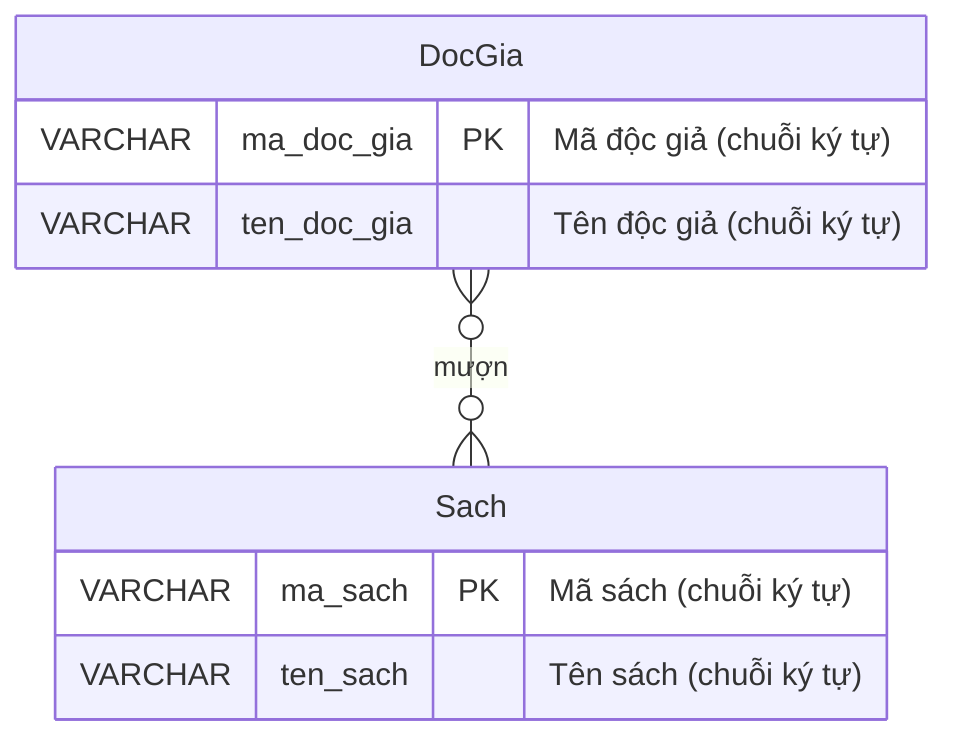

# BTVN 4: Quản lý thư viện

## 1. Mục tiêu
- Hiểu quan hệ nhiều – nhiều (N – N)
- Vẽ ERD với 2 thực thể

## 2. Mô tả & Yêu cầu
Thư viện cần quản lý độc giả và sách. Một độc giả có thể mượn nhiều sách, một cuốn sách có thể được nhiều độc giả mượn.

## 3. Phân tích thực thể & Quan hệ
- **Thực thể 1:** `DocGia` (Mã độc giả, Tên độc giả).
- **Thực thể 2:** `Sach` (Mã sách, Tên sách).
- **Mối quan hệ:** Quan hệ **N - N** (Nhiều - Nhiều). Ở mức độ cơ bản, ta nối trực tiếp hai bảng này với nhau bằng ký hiệu N-N.

## 4. Sơ đồ ERD
*Ký hiệu `}o--o{` trong Mermaid đại diện cho quan hệ Nhiều-Nhiều (N-N).*

