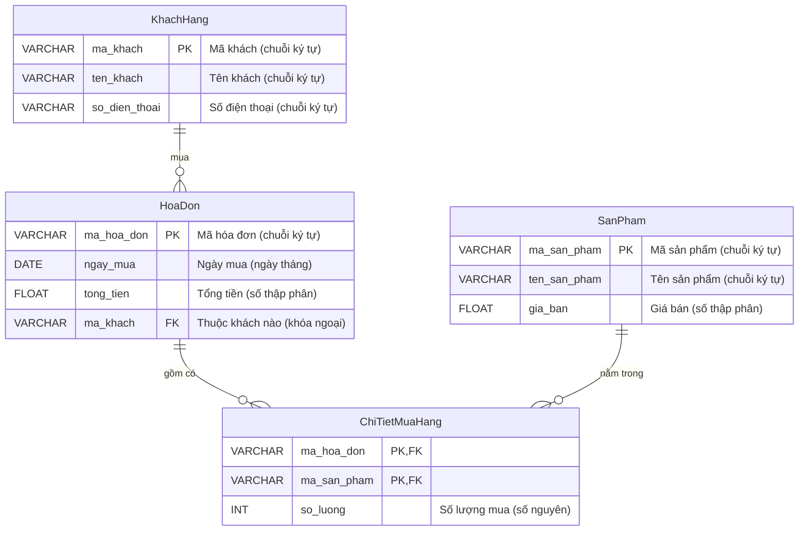

# BTVN 5: Quản lý Bán hàng

## 1. Mục tiêu
- Hiểu quy trình thiết kế CSDL
- Biết tách dữ liệu để tránh trùng lặp

## 2. Phân tích yêu cầu & Các bước thiết kế
Một cửa hàng cần quản lý việc bán sản phẩm cho khách hàng.

1. **Xác định thực thể:** 
   - `KhachHang` (Mã KH, Tên, Số điện thoại)
   - `SanPham` (Mã SP, Tên SP, Giá bán)
   - `HoaDon` (Mã Hóa đơn, Ngày mua, Tổng tiền). Do 1 khách mua nhiều lần nên hóa đơn cần lưu tách biệt.
   
2. **Xác định quan hệ (Chỉ rõ 1-N và N-N):**
   - **Khách hàng & Hóa đơn:** Quan hệ **1-N** (1 Khách hàng có thể có Nhiều Hóa đơn).
   - **Hóa đơn & Sản phẩm:** Bản chất là quan hệ **N-N** (1 Hóa đơn có Nhiều Sản phẩm, và 1 Sản phẩm có thể nằm trong Nhiều Hóa đơn).
   
3. **Tách dữ liệu tránh trùng lặp:**
   - Để giải quyết quan hệ N-N ở trên, ta bắt buộc phải sinh ra một bảng ở giữa gọi là `ChiTietMuaHang`.
   - Bảng này sẽ biến quan hệ N-N thành hai quan hệ 1-N: (Hóa đơn **1-N** Chi tiết mua hàng) và (Sản phẩm **1-N** Chi tiết mua hàng).

## 3. Sơ đồ ERD

