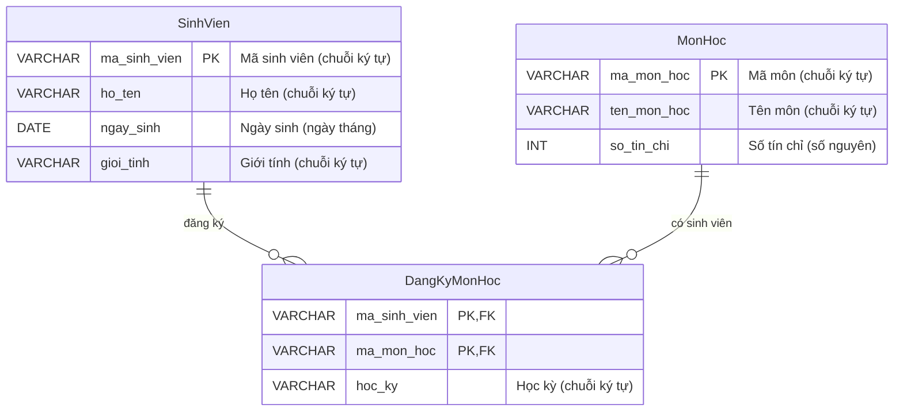

# BTVN 6: Quản lý Sinh viên – Môn học

## 1. Mục tiêu
- Hiểu vai trò của CSDL trong quản lý dữ liệu
- Xác định được thực thể (Entity), thuộc tính, mối quan hệ

## 2. Mô tả & Yêu cầu
Quản lý sinh viên và các môn học mà sinh viên đăng ký.
- Sinh viên: mã sinh viên, họ tên, ngày sinh, giới tính
- Môn học: mã môn, tên môn, số tín chỉ

## 3. Xác định Thực thể & Mối quan hệ
- **Bội số quan hệ:** 1 Sinh viên có thể đăng ký Nhiều Môn học, và 1 Môn học có Nhiều Sinh viên đăng ký. Đây là quan hệ **N-N**.
- **Cách giải quyết:** Khi gặp quan hệ N-N, ta phải đẻ ra một bảng phụ (bảng trung gian) tên là `DangKyMonHoc` để tách nó thành hai quan hệ **1-N**.

## 4. Sơ đồ ERD (Có Khóa chính PK)

