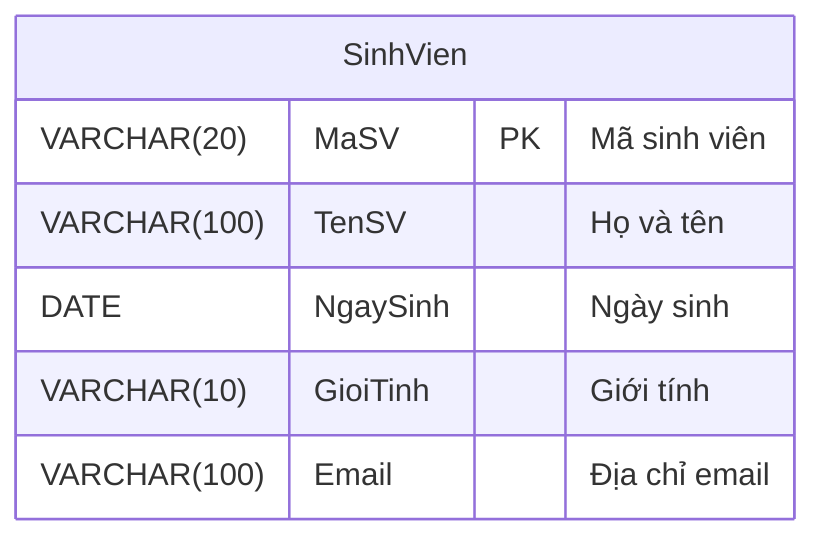

# Bài Tập: Quản Lý Sản Phẩm - Khái Niệm Thực Thể (Entity)

## 1. Mục tiêu bài tập
- Hiểu khái niệm thực thể (Entity) trong thiết kế cơ sở dữ liệu.
- Biết cách biểu diễn thuộc tính của một thực thể trong Sơ đồ thực thể kết hợp (ERD).
- Thực hành chuyển đổi từ sơ đồ thành mã SQL (DDL).

## 2. Mô tả thực thể: SinhVien
Nhà trường cần lưu trữ thông tin cơ bản của sinh viên để quản lý. Thực thể `SinhVien` được xác định với các thuộc tính cơ bản sau:

| Tên trường (Attribute) | Kiểu dữ liệu | Khóa (Key) | Diễn giải |
| :--- | :--- | :--- | :--- |
| **MaSV** | `VARCHAR(20)` | **PK (Primary Key)** | Mã sinh viên (Khóa chính), định danh duy nhất cho mỗi sinh viên. |
| **TenSV** | `VARCHAR(100)` | | Họ và tên đầy đủ của sinh viên. |
| **NgaySinh** | `DATE` | | Ngày sinh của sinh viên. |
| **GioiTinh** | `VARCHAR(10)` | | Giới tính (Nam, Nữ, Khác). |
| **Email** | `VARCHAR(100)` | | Địa chỉ email liên hệ. |

## 3. Sơ đồ thực thể kết hợp (ERD)

Khối biểu đồ dưới đây sử dụng cú pháp Mermaid. Trên giao diện của GitHub, sơ đồ này sẽ được tự động hiển thị dưới dạng hình ảnh trực quan.



## 4. Mã nguồn SQL (DDL) Tham khảo

Dưới đây là câu lệnh SQL để khởi tạo bảng `SinhVien` trong hệ quản trị cơ sở dữ liệu:

```sql
CREATE TABLE SinhVien (
    MaSV VARCHAR(20) PRIMARY KEY,
    TenSV VARCHAR(100) NOT NULL,
    NgaySinh DATE,
    GioiTinh VARCHAR(10),
    Email VARCHAR(100)
);
```
